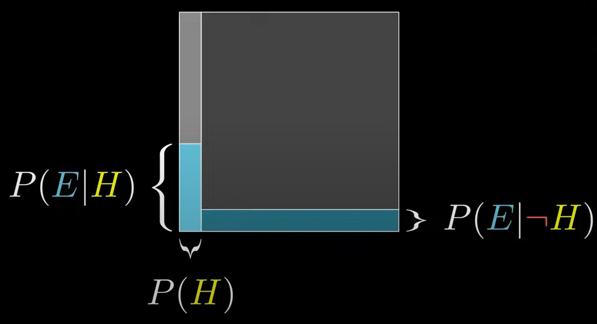

# CW14 04/06 Tuesday - Statistics and Probability
---
### mode - most frequent value
```
def mode(x):
   counters = Counter(x)
   max_counter = max(counts.values())
   return [x_i for x_i, count in counts.interitems()]
      if count == max_count]
```
### mean - average of all values
```
def median(v):
   n = len(v)
   sorted_v = sorted(v)
   midpoint = n //2
   if n % 2 == 1:
      retuen sorted_v[midpoint]
   else:
      lo = midpoint -1
      hi = midpoint
      return (sorted_v[lo] + sorted_v[hi]) /2
```
### median - middle value, special case for odd and even - use Quickselect for faster math
```
def mean(x):
   return sum(x) / len(x)
```   
### quantile - what part of the percentage slice
```
def quantile(x, p)
   p_index = int(p * len(x))
   return sorted(x)[p_index]
```
### dispersion - how spread out the data values are
```
def data_range(x):
   return max(x) - min(x)
```
### Standard Deviation
```
def standard_deviation(x):
   return math.sqrt(variance(x))
```
### Correlation
```
def corrlation(x, y):
   stdev_x = standard_deviation(x)
   stdev_y = standard_deviation(y)
   if stddev_x > 0 and srdev_y > 0:
      return covariance(x, y) / stdev_x / stdev_y
   else:
      return 0
```
## Probability
### Independant events
`P(E,F) = P(E)P(F)`
### Dependat events
`P(E|F) = P(E,F)/P(F)`
### Bayes's Theorem
"reverse" conditional probabilities
`P(A|B)=(P(B|A)P(AP)) / P(B)`


---
[Link to ToC](https://github.com/rafkruczkowski/journal)